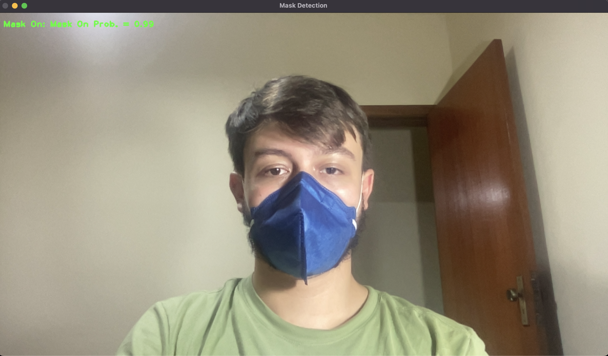

# Real Time Mask Detection

## Introduction 

This repo uses various computer vision technologies, such as deep learning, image acquisition, image processing, feature recognition, and many more, to produce a Real Time Mask Detection application. 

 

## Instructions for Use

1. Clone the repo: 
```bash
git clone git@github.com:g-abilio/mask_detection.git
```

2. Enter in the folder: 
```bash
cd mask_detection
```

3. Run the following command: 
```bash
chmod +x run.sh
```

4. Run the utility: 
```bash
./run.sh
```

#### Important Observations: 
* The app requires a good ilumination to work correctly.
* Now, the compatibility is only with macOS systems (changes in the future).

### Main technologies used: 
   

